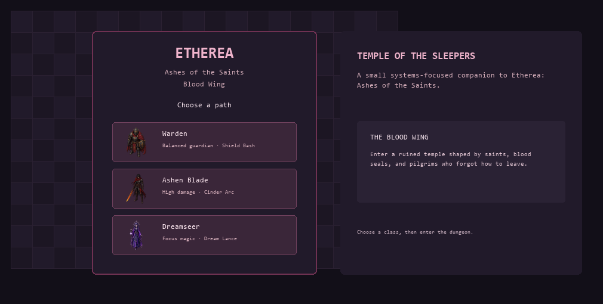
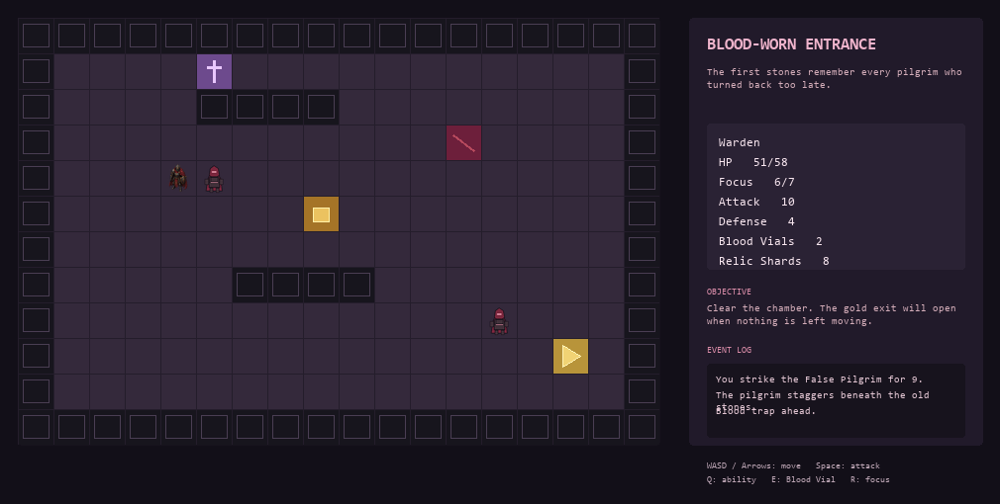
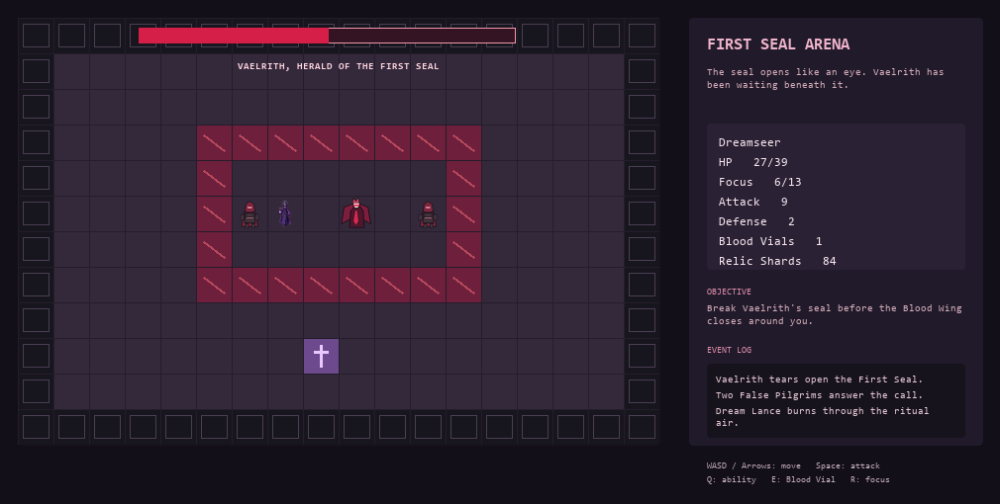
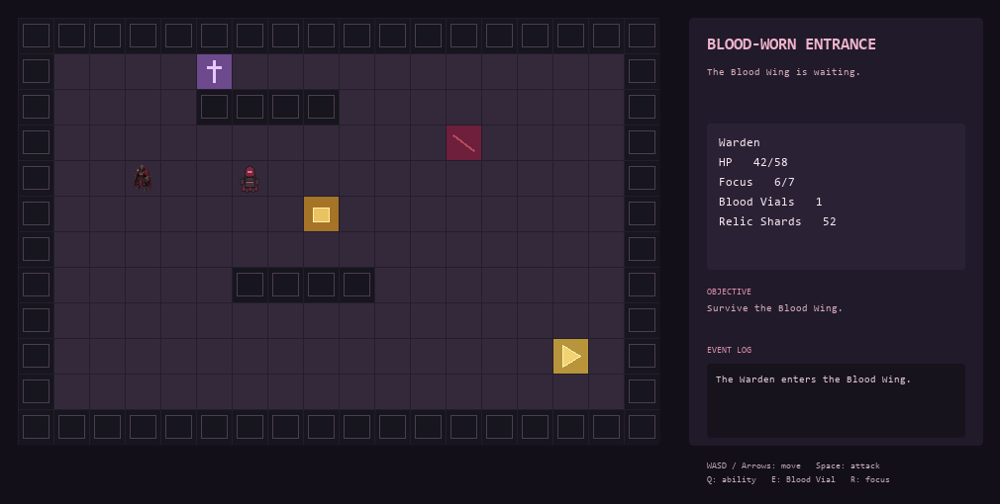

# Etherea: Blood Wing

## Overview

Etherea: Blood Wing is a tile-based Python RPG built with Tkinter and the standard library. It is set in **The Temple of the Sleepers: Blood Wing**, where the player moves through cursed chambers, fights corrupted pilgrims and temple guardians, gathers relic shards, and faces Vaelrith at the First Seal.

The game runs on a pixel-art-inspired grid with original character art, built entirely in Tkinter without external game libraries. The dungeon sits on the left, while player stats, objectives, and event messages stay readable on the right.

## Screenshots and Gameplay Preview









## Connection to Etherea: Ashes of the Saints

This project is a systems-focused companion to a larger Minecraft Bedrock dark fantasy RPG I have been building for three years: **Etherea: Ashes of the Saints**.

The Minecraft project is the larger world — a ruined kingdom shaped by ancient saints, corrupted faith, bloodlines, and a legacy that has not stayed buried. The Temple of the Sleepers is one of its dungeon spaces, with wings built around blood seals, trap corridors, ritual chambers, corrupted pilgrims, and bosses such as Vaelrith and The Somnarch.

This Python version does not try to replace that project. It takes one small part of Etherea — the Blood Wing — and explores how its dungeon flow, enemy behavior, combat, items, and atmosphere could work in code outside Minecraft Bedrock. The lore, enemy names, class identities, and room subtitles all carry over directly from the original world.

## Features

- Tkinter tile map with no Pygame or external graphics library
- Original character portraits for all three classes and every enemy type, rendered directly on the canvas
- Three playable classes: Warden, Ashen Blade, and Dreamseer, each with distinct stats and a class ability
- Four hand-designed rooms in the Blood Wing
- WASD and arrow-key movement with bump-to-attack combat
- Standard attacks, class abilities, Blood Vials, and focus recovery
- Five enemy types: False Pilgrim, Overseer, Sealbound Knight, Bloodbound Pilgrim, and Vaelrith
- Blood traps, saint shrines, reliquaries, gold exits, relic shards, and a live event log
- Shrine choices: restore health, or restore focus and gain a Blood Vial
- Shard shop at each cleared-room threshold: spend 30 relic shards for a Blood Vial
- Vaelrith boss fight with three health-based phases, Blood Pulse bleed, a two-pilgrim summon wave, and escalating attack multipliers
- Status effects: bleed, stun, empowered, and focus drain
- JSON save and load from the game window
- Unit tests covering map construction, combat behavior, and save/load state

## How to Run

Python 3.10 or newer is required. Tkinter is included with standard Python installations on Windows and most Linux distributions. macOS users may need to install it separately via Homebrew.

```bash
python main.py
```

## Controls

| Key | Action |
|-----|--------|
| `WASD` or arrow keys | Move one tile |
| `Space` | Attack an adjacent enemy |
| `Q` | Use class ability |
| `E` | Drink a Blood Vial |
| `R` | Recover a small amount of focus |
| `B` | Save the current run |
| `L` | Load the saved run |

Moving into an enemy tile attacks it directly. Gold exit tiles only open once the chamber is fully cleared.

## Classes

| Class | HP | Attack | Defense | Focus | Ability |
|-------|----|--------|---------|-------|---------|
| Warden | 58 | 10 | 4 | 7 | Shield Bash — stuns and deals bonus damage |
| Ashen Blade | 46 | 14 | 2 | 8 | Cinder Arc — hits all adjacent enemies and applies bleed |
| Dreamseer | 39 | 9 | 2 | 13 | Dream Lance — ranged strike that stuns at distance |

## Project Structure

```text
etherea-tkinter-rpg/
├── main.py
├── README.md
├── requirements.txt
├── assets/                  # Original class and enemy art
├── docs/                    # Screenshots and gameplay preview
├── game/
│   ├── __init__.py
│   ├── engine.py            # Game state, movement, combat, save/load
│   ├── map_data.py          # Tile maps and enemy placement
│   └── models.py            # Player, enemy, and room data models
├── saves/
│   └── .gitkeep
└── tests/
    └── test_engine.py
```

## Systems Practiced

This is a compact upper-intermediate Python project rather than a complete game engine. It covers:

- Object-oriented Python with dataclasses, enums, and factory classmethods
- Game-state management across rooms, inventory, status effects, combat, and boss phases
- Canvas drawing and keyboard input with Tkinter
- Tile-based movement and collision
- Simple enemy AI with directional pathfinding and per-enemy behavior patterns
- JSON save/load with forward-compatible deserialization
- Unit testing game logic independently from the GUI
- Dependency injection for deterministic RNG in tests
- Designing a visual game without Pygame or any external game library

## Design Notes

The visual goal is not detailed pixel art. The game deliberately uses colored tiles, glyphs, and simple canvas shapes so the focus stays on readable gameplay systems and a clear dark-fantasy atmosphere. When original portrait art is available for an entity, it is used. When it is not, the fallback is a colored glyph tile that still communicates the entity type clearly.

The scope is also deliberately smaller than the original Minecraft Bedrock project. The larger Etherea world has room for architectural storytelling, environmental lore, a longer dungeon structure, and multiple story branches. This version is a short playable prototype of one wing of one temple.

## Possible Future Additions

- Sight Wing as a second dungeon route with puzzle and lore focus
- NPC dialogue and branching room events
- Equipment drops and passive stat upgrades from relic shards
- Minimap and room-transition screen
- Sound through a standard-library-friendly approach
- Additional playtesting and balance passes on boss phases
